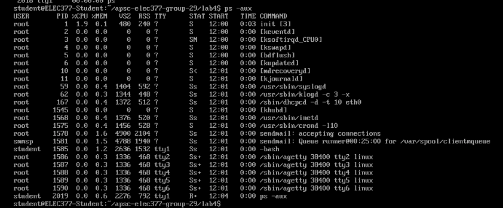
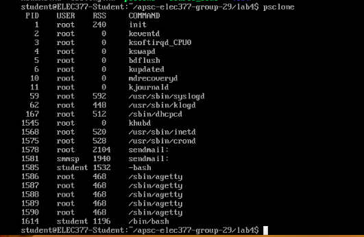
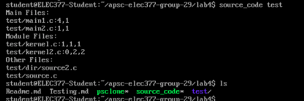

# Lab 4 Testing 
## Curtis Shewchuk SN: 10189026
## Viraj Bangari   SN: 10186046


### Part 1
The way we tested this lab was to compare our output with ps -eo pid,user,rss,args.
We iterated by first printing all the pids, then getting the users, then the rss, and then finally
the args. Once this was done, we looked at the edge cases, such as no RSS in the /status file and
an empty cmdline file. Once all the data was correct, we decided to format our output properly. We
observed that the proper formatting was that the columns were tab separated, and that the column elements
were left padded by the number of characters in the header.

Sample output:

ps -aux output


Our psclone output


### Part 2
We tested this lab by creating some sample code in a directory called test. We wrote a number of printf,
printk and fprintf statements for different types of files (e.g. main, module, and other files). We ran
the command `./source_code test` from this directory, and compared the outputs.

Sample output:


```
Main Files:
test/main1.c:4,1
test/main2.c:1,1
Module Files:
test/kernel.c:1,1,1
test/kernel2.c:0,2,2
Other Files:
test/dir/source2.c
test/source.c
```
