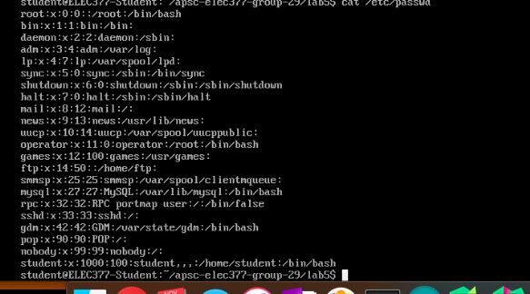
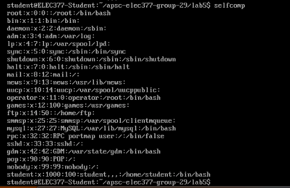
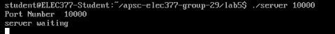
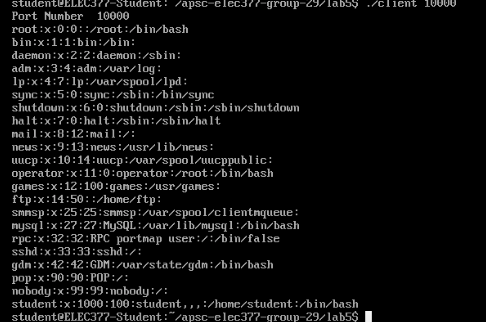

# Lab 5 Testing
### Curtis Shewchuk SN: 10189026
### Viraj Bangari   SN: 10186046

# File Check 
The code we wrote is designed to dump the passwords file, in the /etc/ directory. To ensure our programs (both selfcomp and client) were working properly, we ran the command
```
cat /etc/passwd
```
and viewed the output, to see the file contained in the directory. Below is the output of the command.


We then ran our selfcomp code to ensure the output was the same. Below is the result of running selfcomp.


To test the client, we needed to run two bash windows, one containing the sever, and the other would run the client, which would attack the server. Below is the command of running the server, followed by the run of the client, in a different shell, which dumped the 'passwd' file. The server is run on port 10000, and the client connects to the same port.


